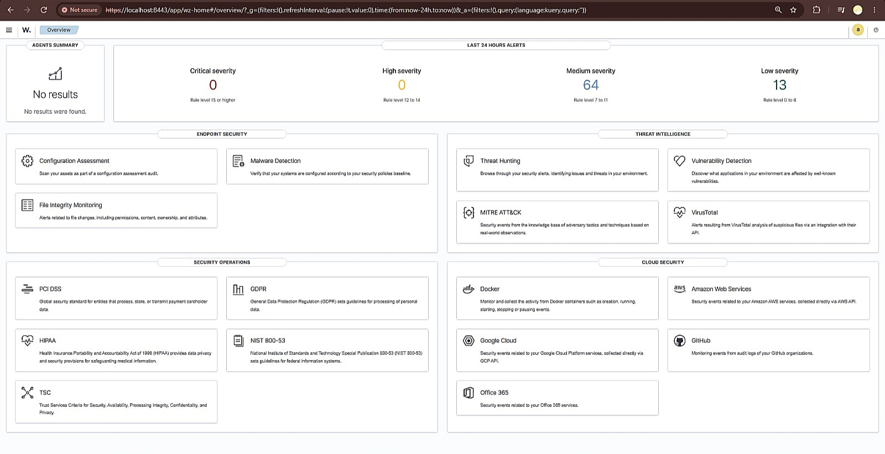
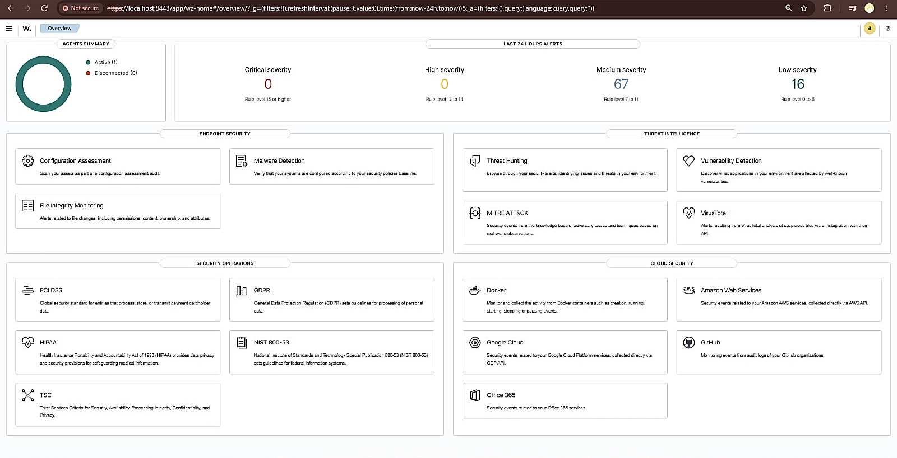
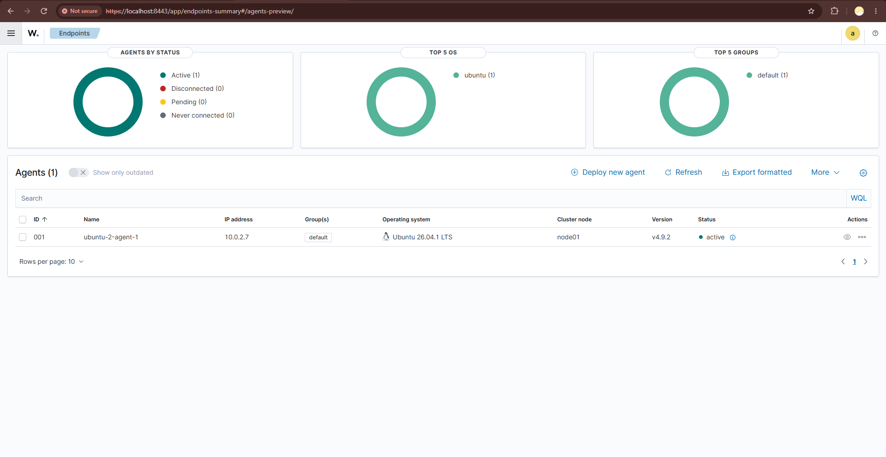
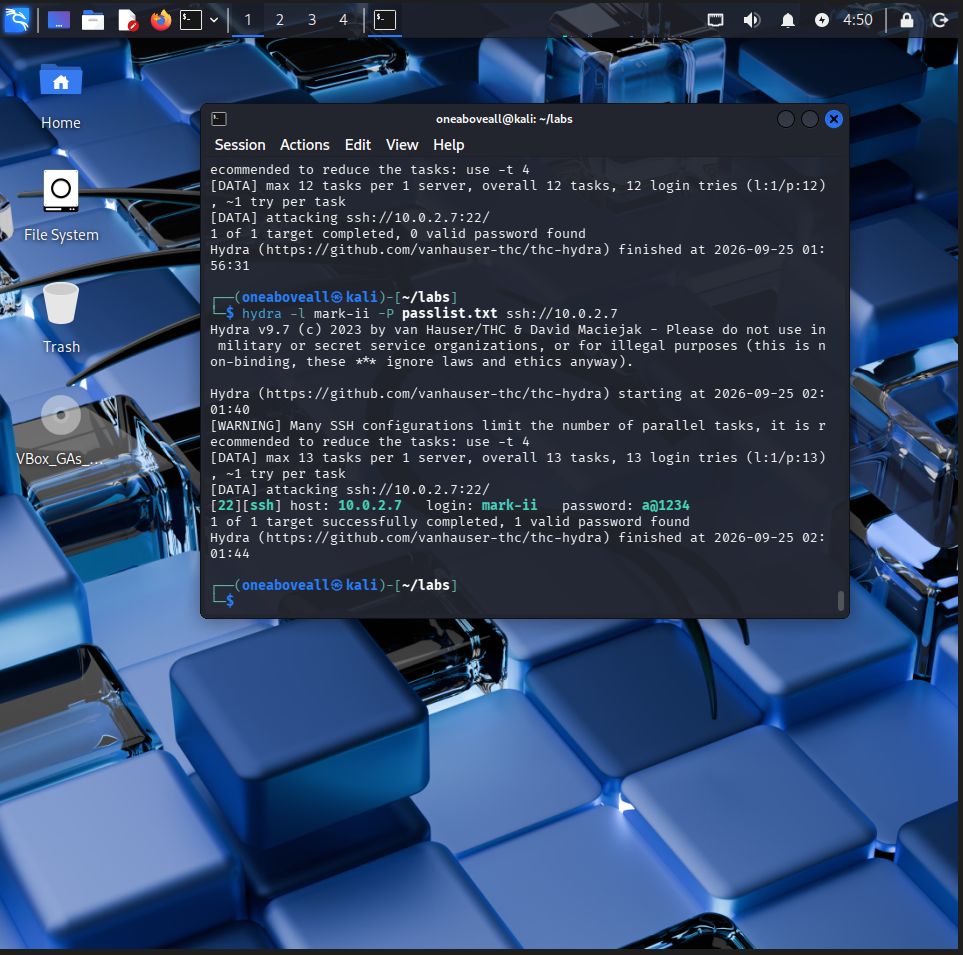
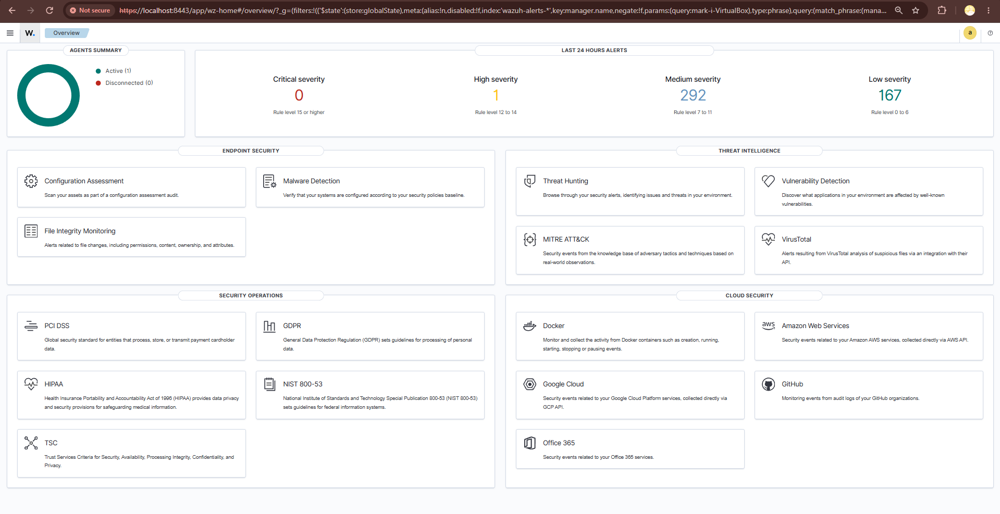
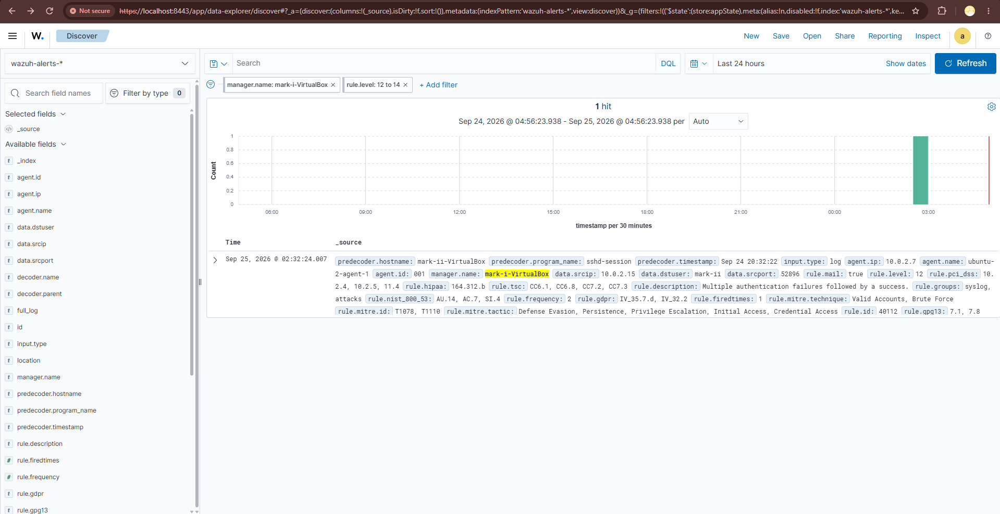
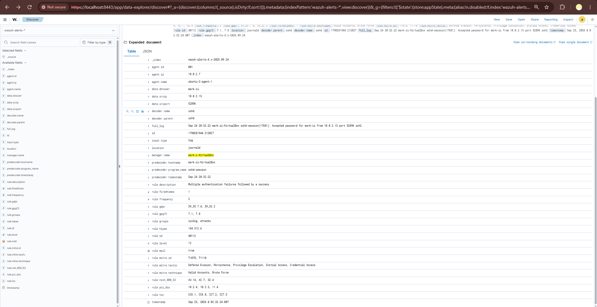

# Home Security Operations Center Lab with Wazuh

## Objective
This project simulates a small home/enterprise Security Operations Center (SOC) 
using Wazuh, an open-source SIEM (Security Information and Event Management) 
platform. It demonstrates the full detection lifecycle: building a monitored 
environment, generating a real attack, detecting it, investigating the alert, 
and producing both a manual and an automated incident report — the core 
workflow of a SOC/Cyber Defense Analyst.

## Lab Architecture
- **Ubuntu-1 (Wazuh Manager)** — 4GB RAM, 4 cores. Runs the Wazuh manager, 
  indexer, and dashboard. Receives and analyzes logs from agents.
- **Ubuntu-2 (Monitored Endpoint)** — 2GB RAM, 2 cores. Runs a Wazuh agent 
  that forwards system logs (including SSH authentication events) to the 
  manager.
- **Kali Linux (Attacker)** — 4GB RAM, powered on only during the attack 
  simulation. Used to run a controlled SSH brute-force attack.
- All VMs are connected via an isolated VirtualBox NAT Network, with no 
  connection to the host's main network.

**Network layout:**

| Role | Machine | IP Address |
|---|---|---|
| Manager | Ubuntu-1 | 10.0.2.6 |
| Monitored Endpoint | Ubuntu-2 | 10.0.2.7 |
| Attacker | Kali Linux | 10.0.2.15 |

## Tools Used
- Wazuh 4.9.2 (Manager, Indexer, Dashboard)
- Ubuntu Server
- Kali Linux
- Hydra (SSH brute-force simulation tool)
- Oracle VirtualBox
- Python 3, with the `requests` and `python-dotenv` libraries
- AbuseIPDB API (for threat intelligence lookups)

## Project Workflow
This project follows the same lifecycle a real SOC analyst would follow when 
handling an incident:

1. **Build** — set up a monitored lab environment (manager + endpoint)
2. **Attack** — simulate a real threat (SSH brute-force) from an external 
   machine
3. **Detect** — confirm the SIEM correctly identifies the attack
4. **Investigate** — manually analyze the alert and document findings
5. **Automate** — build a script that performs this investigation 
   automatically, saving analyst time

## Setup
Detailed installation steps are documented separately, since they involve 
many small configuration steps:
- [Wazuh Manager Installation](setup/wazuh-manager-installation.md) — how the 
  Wazuh manager, indexer, and dashboard were installed and configured on 
  Ubuntu-1
- [Wazuh Agent Setup](setup/linux-agent-setup.md) — how the monitoring agent 
  was installed on Ubuntu-2 and connected to the manager

Before the agent was connected, the dashboard showed no active endpoints:



After the agent was installed and connected, it appeared as active:




## Attack Scenario
An SSH brute-force attack was launched from Kali Linux against the Ubuntu-2 
endpoint's `mark-ii` user account, using the tool Hydra with a custom 
password list. The attack succeeded in guessing the correct password, 
simulating a real-world credential compromise.



Full details, including the exact commands used: 
[SSH Brute-Force Simulation](attack-simulation/ssh-bruteforce-simulation.md)

## Detection
Wazuh detected the attack using its built-in correlation rule for "Multiple 
authentication failures followed by a success" (Rule ID 40112, Severity: 
High). This means Wazuh noticed several failed login attempts in a row, 
followed by one that succeeded — a strong signal of a brute-force attack.

The alert was automatically mapped to two real-world attacker frameworks 
known as MITRE ATT&CK techniques:
- **T1110 — Brute Force**
- **T1078 — Valid Accounts**





## Incident Report (Manual)
A complete, hand-written investigation was produced to document the incident 
the way a real SOC analyst would — identifying what happened, when, who was 
responsible, what was affected, and what should be done about it:

[Incident Report — SSH Brute-Force](reports/incident-report-ssh-bruteforce.md)

## Automated Incident Reporting (Python + Wazuh API)
Manually reading dashboards and writing reports takes time — time an analyst 
often doesn't have during an active incident. To solve this, a Python script 
(`scripts/fetch_alerts.py`) was built to automate the entire investigation 
process.

**What the script does, step by step:**
1. Connects directly to the Wazuh Indexer's API (the database where all 
   alerts are stored) at `https://localhost:9200`
2. Searches for any alert matching the SSH brute-force detection rule 
   (Rule ID 40112)
3. Takes the attacker's IP address from that alert and checks it against 
   [AbuseIPDB](https://www.abuseipdb.com/), a free public database that 
   tracks known malicious IP addresses worldwide
4. If the IP is a private/internal address (as it is in this lab, since the 
   "attacker" is another VM on the same isolated network), the script 
   correctly skips the public lookup and says so — it doesn't pretend to 
   have data it can't actually get
5. Combines everything into a clean, readable incident report and saves it 
   automatically to `reports/auto-generated-draft-report.md`

**How to run it yourself:**

```bash
pip install requests python-dotenv
python scripts/fetch_alerts.py
```

The script needs an AbuseIPDB API key to work. Create a file named `.env` in 
the project's root folder (this file is intentionally excluded from the 
repository via `.gitignore`, since API keys should never be made public) 
containing:

```
ABUSEIPDB_API_KEY=your_own_key_here
```

This script demonstrates practical SOC automation: turning a multi-step 
manual investigation into a single command anyone on a security team could 
run to get an instant, ready-to-review draft — reducing response time during 
an active incident.

## What I Learned
- How a SIEM (Security Information and Event Management system) actually 
  works behind the scenes: logs are collected, decoded into structured data, 
  matched against detection rules, and turned into alerts
- How to build an isolated virtual network so multiple VMs can talk to each 
  other without being exposed to the internet or the host machine
- The difference between an application login (like a dashboard password) 
  and an operating system login — a mistake I made and had to fix during 
  this project
- How to read and interpret a real security alert, including how it maps to 
  MITRE ATT&CK, a widely-used framework that categorizes real attacker 
  behavior
- How to simulate a real, working brute-force attack safely, without any 
  risk to real systems
- How to use a SIEM's API programmatically with Python, and how to keep 
  sensitive information like API keys out of a public GitHub repository 
  using environment variables

## Limitations
Being transparent about a project's limitations is part of good security 
documentation. This lab has a few:
- The manager and agent both ran on lightweight virtual machines with 
  limited RAM; a real production SOC would use dedicated, more powerful 
  servers and monitor many more devices at once
- Only one type of attack (SSH brute-force) was tested; real-world SOC teams 
  deal with many different types of threats
- The password list used for the attack was small and made specifically for 
  this demonstration, not a realistic attacker's full wordlist
- Because the "attacker" (Kali) and the "victim" (Ubuntu-2) are both on the 
  same private lab network, the automated threat intelligence check 
  correctly reports the IP as internal and does not return live data from 
  AbuseIPDB. If this same script were pointed at a real, public-facing 
  attack, it would return real reputation scores, country of origin, and 
  internet provider information
- Wazuh only stored one final "alert" for this attack (the summary of 
  failures followed by a success), not a separate alert for every individual 
  failed login attempt — so the report uses a field called `rule.frequency` 
  as the closest available estimate of how many attempts happened before 
  the successful one

## Ethical Note
All attack simulation in this project was performed exclusively against 
virtual machines owned and controlled by the author, inside a fully 
isolated virtual network with no connection to any real production system, 
third party, or the public internet.